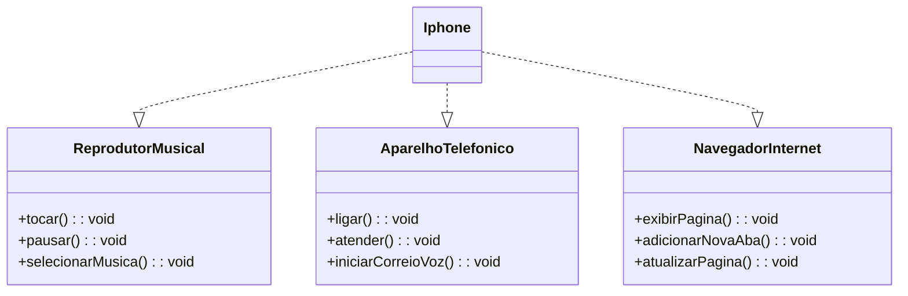

# 📱 Projeto: Simulação das Funções do iPhone com Java e UML



Este projeto simula as funções básicas de um iPhone, incluindo:

- 🎵 Reprodutor Musical
- 📞 Aparelho Telefônico
- 🌐 Navegador de Internet

---

## 📌 Diagrama UML (Classes e Interfaces)

Abaixo está o diagrama UML que representa a estrutura de classes e interfaces deste projeto:

**Legenda:**
- A classe `Iphone` implementa as interfaces:
  - `ReprodutorMusical`
  - `AparelhoTelefonico`
  - `NavegadorInternet`

---

## 📌 Estrutura do Menu do Programa

O programa contém um menu com três abas principais:

1. **Reprodutor Musical**
   - Tocar música
   - Pausar música
   - Selecionar música

2. **Aparelho Telefônico**
   - Ligar
   - Atender ligação
   - Iniciar correio de voz

3. **Navegador de Internet**
   - Exibir página
   - Adicionar nova aba
   - Atualizar página

---


## ✅ Tecnologias utilizadas:

- Linguagem: Java ☕
- Paradigma: Programação Orientada a Objetos (POO)
- Ferramentas: Eclipse / VSCode / IntelliJ
- UML: PlantUML

---

## ✅ Como executar:

```bash
javac *.java
java Main


